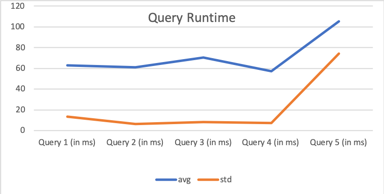

# CSED 516 Homework 2 Mengying(Monique) Bi
## What to turn in:
You will turn in:
  - SQL for the queries
  - Runtimes for each query
  - Number of rows returned
  - First two rows from the result set (or all rows if a query returns fewer than 2 rows) 
  - A brief discussion of the query runtimes that you observed in different settings
## 1. Setting up your Snowflake account (0 points)
## 2. Create a new database (0 points)
```sql
    CREATE DATABASE mybi_myawesomedatabase;
```

## 3. Ingest data (10 points)

### Ingesting data from another Snowflake database
`insert` the tuples:
  ```sql
    CREATE TABLE customer(
    C_CustKey int ,
    C_Name varchar(64) ,
    C_Address varchar(64) ,
    C_NationKey int ,
    C_Phone varchar(64) ,
    C_AcctBal decimal(13, 2) ,
    C_MktSegment varchar(64) ,
    C_Comment varchar(120) ,
    skip varchar(64)
    );
```
Runtime: 111ms
```sql

    CREATE TABLE lineitem(
    L_OrderKey int ,
    L_PartKey int ,
    L_SuppKey int ,
    L_LineNumber int ,
    L_Quantity int ,
    L_ExtendedPrice decimal(13, 2) ,
    L_Discount decimal(13, 2) ,
    L_Tax decimal(13, 2) ,
    L_ReturnFlag varchar(64) ,
    L_LineStatus varchar(64) ,
    L_ShipDate datetime ,
    L_CommitDate datetime ,
    L_ReceiptDate datetime ,
    L_ShipInstruct varchar(64) ,
    L_ShipMode varchar(64) ,
    L_Comment varchar(64) ,
    skip varchar(64)
    );
```
Runtime: 108ms
```sql
    CREATE TABLE nation(
    N_NationKey int ,
    N_Name varchar(64) ,
    N_RegionKey int ,
    N_Comment varchar(160) ,
    skip varchar(64)
    );
```
Runtime: 107ms
```sql
    CREATE TABLE orders(
    O_OrderKey int ,
    O_CustKey int ,
    O_OrderStatus varchar(64) ,
    O_TotalPrice decimal(13, 2) ,
    O_OrderDate datetime ,
    O_OrderPriority varchar(15) ,
    O_Clerk varchar(64) ,
    O_ShipPriority int ,
    O_Comment varchar(80) ,
    skip varchar(64)
    );
```
Runtime: 99ms
```sql
    CREATE TABLE part(
    P_PartKey int ,
    P_Name varchar(64) ,
    P_Mfgr varchar(64) ,
    P_Brand varchar(64) ,
    P_Type varchar(64) ,
    P_Size int ,
    P_Container varchar(64) ,
    P_RetailPrice decimal(13, 2) ,
    P_Comment varchar(64) ,
    skip varchar(64)
    );
```
Runtime: 99ms
```sql
    CREATE TABLE partsupp(
    PS_PartKey int ,
    PS_SuppKey int ,
    PS_AvailQty int ,
    PS_SupplyCost decimal(13, 2) ,
    PS_Comment varchar(200) ,
    skip varchar(64)
    );
```
Runtime: 93ms
```sql
    CREATE TABLE region(
    R_RegionKey int ,
    R_Name varchar(64) ,
    R_Comment varchar(160) ,
    skip varchar(64)
    );
```
Runtime: 88ms
```sql
    CREATE TABLE supplier(
    S_SuppKey int ,
    S_Name varchar(64) ,
    S_Address varchar(64) ,
    S_NationKey int ,
    S_Phone varchar(18) ,
    S_AcctBal decimal(13, 2) ,
    S_Comment varchar(105) ,
    skip varchar(64)
    );
```
Runtime: 82ms

```sql
    INSERT INTO customer
    (c_custkey, c_name, c_address, c_nationkey, c_phone, c_acctbal,c_mktsegment, c_comment)
    (SELECT * FROM snowflake_sample_data.tpch_sf10.customer);
```
Runtime: 2.51s
Number of rows: 1,500,000
```sql
    INSERT INTO lineitem
    (L_OrderKey, L_PartKey, L_SuppKey, L_LineNumber,L_Quantity, L_ExtendedPrice,L_Discount, L_Tax, L_ReturnFlag,L_LineStatus, L_ShipDate, L_CommitDate, L_ReceiptDate, L_ShipInstruct, L_ShipMode, L_Comment)
    (SELECT * FROM snowflake_sample_data.tpch_sf10.lineitem);
```
Runtime: 7.28s
Number of rows: 59,986,052
```sql
   INSERT INTO nation
    (N_NationKey, N_Name, N_RegionKey, N_Comment)
    (SELECT * FROM snowflake_sample_data.tpch_sf10.nation);
```
Runtime: 526ms
Number of rows: 25

```sql
    INSERT INTO orders
    (O_OrderKey,O_CustKey, O_OrderStatus, O_TotalPrice, O_OrderDate, O_OrderPriority, O_Clerk, O_ShipPriority, O_Comment)
    (SELECT * FROM snowflake_sample_data.tpch_sf10.orders);
```
Runtime: 2.35s
Number of rows: 15000000

```sql
   INSERT INTO part(
    P_PartKey,P_Name, P_Mfgr, P_Brand, P_Type, P_Size, P_Container, P_RetailPrice, P_Comment)
    (SELECT * FROM snowflake_sample_data.tpch_sf10.part); 
```
Runtime: 3.4s
Number of rows: 2000000

```sql
    INSERT INTO partsupp
    (PS_PartKey, PS_SuppKey, PS_AvailQty, PS_SupplyCost, PS_Comment)
    (SELECT * FROM snowflake_sample_data.tpch_sf10.partsupp);
```
Runtime: 2.87s
Number of rows: 8000000

```sql
    INSERT INTO region
    (R_RegionKey, R_Name, R_Comment)
    (SELECT * FROM snowflake_sample_data.tpch_sf10.region);
```
Runtime: 701ms
Number of rows: 5

```sql
    INSERT INTO supplier
    (S_SuppKey, S_Name, S_Address, S_NationKey, S_Phone, S_AcctBal, S_Comment)
    (SELECT * FROM snowflake_sample_data.tpch_sf10.supplier);
```
Runtime: 1.44s
Number of rows: 100000

### Ingesting data from S3
```sql
    -- Delete table contents
    truncate table customer;
    truncate table lineitem;
    truncate table nation;
    truncate table orders;
    truncate table part;
    truncate table partsupp;
    truncate table region;
    truncate table supplier;
```
- Differences between truncate & delete:

    Truncate: Removes all rows from a table, but leaves the table privileges and constraints on the table. Also deletes the load metadata for the table, which allows the same previous files to be loaded into the table again after the completing the truncate operation.

    Delete: Does not delete the external file load history. If users delete rows loaded into the table from a staged file, thye cannot load the data from the same file again unless modifying the file and stage it.

    I prefer Truncate, since it's more flexible on the resource of data that user wants to upload.
    
```sql
    -- Define the formatting details of the external S3 data
    create or replace file format mybi_csv type = csv field_delimiter = '|';
```
Runtime: 78ms

```sql
-- Create a new stage in Snowflake
create or replace stage mybi_customers url='s3://uwdb/tpch/uniform/10GB/customer.tbl' file_format = mybi_csv;
create or replace stage mybi_lineitem url='s3://uwdb/tpch/uniform/10GB/lineitem.tbl' file_format = mybi_csv;
create or replace stage mybi_nation url='s3://uwdb/tpch/uniform/10GB/nation.tbl' file_format = mybi_csv;
create or replace stage mybi_orders url='s3://uwdb/tpch/uniform/10GB/orders.tbl' file_format = mybi_csv;
create or replace stage mybi_part url='s3://uwdb/tpch/uniform/10GB/part.tbl' file_format = mybi_csv;
create or replace stage mybi_partsupp url='s3://uwdb/tpch/uniform/10GB/partsupp.tbl' file_format = mybi_csv;
create or replace stage mybi_region url='s3://uwdb/tpch/uniform/10GB/region.tbl' file_format = mybi_csv;
create or replace stage mybi_supplier url='s3://uwdb/tpch/uniform/10GB/supplier.tbl' file_format = mybi_csv;
```
```sql
-- Ingest the data
copy into customer from @mybi_customers;
```
Runtime: 14.14s 

Number of rows: 1500000
```sql
copy into lineitem from @mybi_lineitem;
```
Runtime: 3m39s

Number of rows: 59986052
```sql
copy into nation from @mybi_nation;
```
Runtime: 708ms

Number of rows: 25
```sql
copy into orders from @mybi_orders;
```
Runtime: 55.82s

Number of rows: 15000000
```sql
copy into part from @mybi_part;
```
Runtime: 9.09s

Number of rows: 2000000
```sql
copy into partsupp from @mybi_partsupp;
```
Runtime: 1m1s

Number of rows: 8000000
```sql
copy into region from @mybi_region;
```
Runtime: 1.16s

Number of rows: 5
```sql
copy into supplier from @mybi_supplier;
```
Runtime: 2.14s

Number of rows: 100000

- The numbers of rows match the ones I found in Redshift. 

## 4. Run Queries (25 points)

1. What is the total number of parts offered by each supplier? The query should return the name of the supplier and the total number of parts.
```sql
SELECT s.s_name AS supplier_name, SUM(ps.ps_availqty) AS Total_part_num
FROM supplier AS s, partsupp AS ps
WHERE ps.ps_suppkey = s.s_suppkey
GROUP BY supplier_name;
```
Number of rows: 100,000 

Result first two rows:

|SUPPLIER_NAME | TOTAL_PART_NUM |
|--------------|----------------|
|Supplier#000056858|390815|
|Supplier#000081790|383068|

2. What is the cost of the most expensive part by any supplier?
-- The query should return only the price of that most expensive part. No need to return the name.
```sql
SELECT MAX(p.p_retailprice) AS max_price
FROM partsupp AS ps, part AS p
WHERE ps.ps_partkey = p.p_partkey;
```
Number of rows: 1

Result first two rows:

|MAX_PRICE|
|--------------|
|2098.99|

3. What is the cost of the most expensive part for each supplier?The query should return the name of the supplier and the cost of the most expensive part but you do not need to return the name of that part.
```sql
SELECT s.s_name AS supplier_name, MAX(p.p_retailprice) AS max_price 
FROM supplier AS s, partsupp AS ps, part AS p
WHERE ps.ps_suppkey = s.s_suppkey AND ps.ps_partkey = p.p_partkey
GROUP BY supplier_name;
```
Number of rows: 100,000 

Result first two rows:

|SUPPLIER_NAME|MAX_PRICE|
|--------------|--------------|
|Supplier#000046927|2020.92|
|Supplier#000022639|1734.63|

4. What is the total number of customers per nation? The query should return the name of the nation and the number of unique customers.
```sql
SELECT n.n_name AS nation, count(c.c_custkey) AS total_customer_num
FROM customer AS c, nation AS n
WHERE n.n_nationkey = c.c_nationkey
GROUP BY nation;
```
Number of rows: 25

Result first two rows:

|NATION|TOTAL_CUSTOMER_NUM|
|--------------|--------------|
|UNITED STATES|60006|
|EGYPT|59969|

5. What is number of parts shipped between 10 oct, 1996 and 10 nov, 1996 for each supplier? The query should return the name of the supplier and the number of parts
```sql
SELECT s.s_name AS supplier_name, SUM(l.l_quantity) AS num_of_parts
FROM lineitem AS l, supplier AS s
WHERE l.l_suppkey= s.s_suppkey AND (l.l_shipdate >= '1996-10-10 00:00:00' 
AND l.l_shipdate <  '1996-11-11 00:00:00')
GROUP BY supplier_name;
```
Number of rows: 99,964

Result first two rows:

|SUPPLIER_NAME|NUM_OF_PARTS|
|--------------|--------------|
|Supplier#000018244|179|
|Supplier#000091102|195|


- Plot the average and either min/max or standard deviation.

Runtime:

|Query # |1  |2	|3	|4	|5	|6	|avg	|std|
|---|---|---|---|---|---|---|---|---|
|Query 1 (in ms)	|60	|88	|57	|52	|53	|68	|63.000	|13.535|
|Query 2 (in ms)	|55	|69	|69	|61	|57	|55	|61.000	|6.573|
|Query 3 (in ms)	|75	|63	|65	|79	|80	|61	|70.500	|8.479|
|Query 4 (in ms)	|64	|65	|52	|50	|50	|63	|57.333	|7.367|
|Query 5 (in ms)	|51	|191|57	|69	|210|55	|105.500|74.075|



## 5. Snowflake and Redshift Comparison (15 points)


  - Our Snowflake cluster runs on S3, which means both the `snowflake_sample_data.tpch_sf10` and `s3://uwdb/tpch/uniform/10GB` data are coming from the same place.  Briefly discuss the performance differences (if any) that you observed between the two data import methods, and why the differences might exist.

    Runtime Comparision:

    |Table name | Ingesting from Snowflake Cluster | Ingesting from S3|
    |-----|-----|-----|
    |customer|2.51s| 14.14s|
    |lineitem|7.28s|3m39s|
    |nation|526ms|708ms|
    |orders|2.35s|55.82s|
    |part|3.4s|9.09s|
    |partsupp|2.87s|1m1s|
    |region|701ms|1.16s|
    |supplier|1.44s|2.142|


    The runtime importing the data from S3 is way longer than from another Snowflacke cluster, especially for tables with more rows (eg.lineitem table take 7.28s on snowflake yet 3m39s on S3). Even though the data are coming from the same place, but I assume it will take extra time to transform the data structure when ingesting directly from S3 comparing to from snowflake cluster. 

  - Compare the time to run queries for the TPCH 10GB dataset to your Redshift experiments.
    
    |Query # Redshift	|1	|2	|3	|4	|5	|6	|avg	|std|
    |---|---|---|---|---|---|---|---|---|
    |Query 1 (in ms)|	1962|	1804|	1353	|2154	|2025	|1506	|1800.667|	312.552|
    |Query 2 (in ms)|	0.034|	0.034|	0.029|	0.058|	0.032|	0.029|	0.036|	0.011|
    |Query 3 (in ms)|	3728|	3460|	2826|	3552|	3592	|2524|	3280.333|	486.227|
    |Query 4 (in ms)|	0.047	|0.044|	0.046	|0.047|	0.051|	0.046|	0.047	|0.002|
    |Query 5 (in ms)|	4472|	5193|	4447	|5273	|4726	|3881	|4665.333|	519.923|

    Comparing the time to run queries for the TPCH 10GB dataset on Redshift and Snowflake, for query 1,3,5, it takes longer time to run on Redshift, yet for Query 2 and 4, Redshift runs faster. The different among Query 2 and for and Query 1, 3, 5 is on the number of rows returned. 

  - Did any of the your queries require changes to run on Snowflake, or were they identical to those you ran on Redshift?

    All the queries I run on SnowFlake were identical to the ones on Redshift.

  - Both Redshift and Snowflake have similar offerings and interface.  Briefly compare your experience with the two systems.  After using both, when would you choose to use Redshift over Snowflake?  Snowflake over Redshift?
    
    I prefer Snowflake over Redshift for the following reasons:

    - Snowflake does not need complicated set-up(eg. IAM roles, security groups...)
    - Easier to retrieve runtime of previous queires ran on Snowflake. While on Redshift, I need to switch to the cluster consol, and not every queries shows the runtime, only the ones with longer runtime. 
    - Able to run multiple queires on Snowflake versus one query a time on Redshift. 