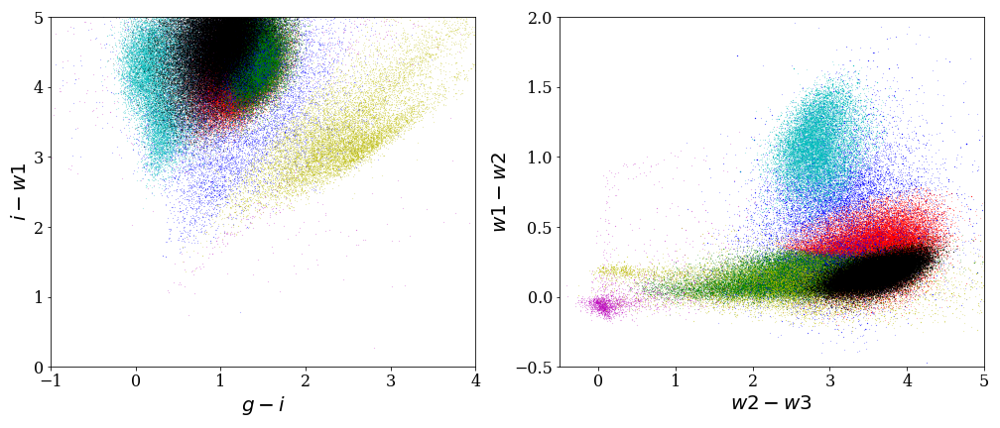

# Homework 3

## Due Tuesday, November 12th at 11:59pm

## Objectives: 

Become familiar with Apache Spark. Learn how to use Spark to perform
data management tasks and simple data analysis tasks.

## Assignment tools:
  - [Apache Spark on Amazon Elastic Map Reduce](https://aws.amazon.com/emr/features/spark)

## What to turn in:
  - Turn in code as well as results (with plots) as listed in each question
  - Submit everything as a single pdf or Markdown file

## How to submit the assignment:

In your GitLab repository you should see a directory called `Homeworks/hw3`. Put your report in that directory. Remember to commit and push your report to GitLab (`git add && git commit && git push`)!

You should add your report early and keep updating it and pushing it as you do more work. We will collect the final version after the deadline passes. If you need extra time on an assignment, let us know. This is a graduate course, so we are reasonably flexible with deadlines but please do not overuse this flexibility. Use extra time only when you truly need it.

# Assignment Details

In this assignment, we will work with astronomy data. We first give an overview of the application that motivates the analysis we will perform in the assignment.

Large-scale astronomical imaging surveys (e.g., <a href="http://www.sdss.org/">Sloan Digital Sky Survey</a>) collect databases of telescope images. The key analysis is to extract sources (galaxies, stars, quasars, etc.) from these images. While extracting sources is a simple process, classifying these
sources into object types is difficult. An example of this type of
classification is the use of multiple wavelength observations in
separating high redshift quasars (i.e., galaxies powered by a central
black hole) from stars within our galaxy. Given that both quasars and
stars are point sources (i.e., they cannot be distinguished by data
from a single image alone) and that there are 400-times more stars
than quasars within a data set, the accuracy of this classification
determines the success of finding some of the highest redshift sources
within the universe.

The Gaussian Mixture Model (GMM) algorithm can serve as a foundation to perform this
classification. It is a clustering algorithm that will help us group
sources into different types. We describe this algorithm below.

In this assignment, we will use as input a table that contains sources
extracted from telescope images and their features. We will apply the GMM algorithm to build a model of those
sources.

For more details about the application, please refer to <a href="https://homes.cs.washington.edu/~magda/papers/maas-imdm15.pdf">[RM15]</a>.

## Data

The data takes the form of a table with five attributes:

| ID | X | Y | Z | W |
|----|---|---|---|---|
| 1237661088029606015 | 0.575469| 1.37509| 1.941| -0.0360003 |
| 1237661088024822536 | 1.00735| 3.06909| 3.701| -0.059 |     
| 1237661088024822606| 1.4684| 2.5072| 3.184| -0.105 |     
| 1237661088024887302 | 0.761256| 1.44754| 1.356| -0.0959997 | 

The first attribute, `ID`, is a unique identifier for each source. Each of the other four attributes, `X`, `Y`, `Z`, and `W`
is a measurement for that source. Thus each column is a type of measurement and each row is a source.

## Algorithm

In our application, we have points (i.e., sources) in a 4D space. We
want to cluster them to identify different types of sources. We could
use different clustering algorithms. GMM is one
type of algorithm that has been shown to work well for these types of
applications, so we will use it.

A Gaussian mixture model is a model of a distribution as a
mixture of K separate multivariate normal distributions, each with three
parameters: mean, covariance, and weight.  We will talk about
covariance rather than variance or standard deviation because our data
is in a 4D space. Thus, the mean is a 4D vector and the
covariance is a 4x4 matrix. The mean and covariance describe 
the position and shape of the Gaussian.  The weight captures the relative
amplitude of the Gaussian in the model. The sum of the weights of
the Gaussians in the model is 1.0. GMM assumes all the data
points are generated from this mixture of Gaussian distributions.

There is no closed-form analytic solution to estimate the parameters of a
mixture of Gaussians from a sample data set. The standard approach is
to iteratively maximize the likelihood function of the mixture model
in an algorithm called expectation maximization (EM).
Expectation maximization [AD77] has two steps: the E-step and M-step,
which are repeated until parameters converge to maximize the
likelihood of the observations. EM starts by assuming a set of K random
components. It computes for each observation the probability of
belonging to each component of the model. This is called the E-step.
The second step in the iterative process, called the M-step, uses the
points associated with each component to estimate better parameters for
each of the K components. The E-step and the M-step are repeated until
convergence.

The following figure shows the results of applying GMM to a similar
astronomical data <a href="https://homes.cs.washington.edu/~magda/papers/maas-imdm15.pdf">[RM15]</a>. The figure shows two 2D projections of the
4D model.

## Environment

Spark MLLib implements GMM and, in this assignment, we will use it to
cluster 1.9M astronomical sources:
1. Deploy EMR with Spark: To deploy Spark on Elastic
  MapReduce use the instructions from the Spark section(s).
  - *Make sure that your security group has the inbound ports listed in the section notes open*
  - *Make sure you select a key pair that you have access to!*
2. Data load and transform: Data is provided in the form of
  CSV files in S3. 
  - Read the data from S3. 
  - Parse it and otherwise prepare it as needed for the analysis.
  - Bucket: `csed516`
  - Key: `smalldatasetspark/wise-colors-15-20-subsetsmall8.csv`
3. Run GMM: From MLlib on Spark, the GMM implementation is available in Scala, Java, Python and R.
    Choose the language that you prefer and run GMM on the sources that you prepared above. Remember the points are in four dimensions.

## Questions

### Find and describe components (20 Points)
  - Use the MLlib implementation of GMM with k=7 components to build a model of the data.
  - List the weight, mean(mu), and covariance matrix of each component.
  - Run this experiment on a 2-node (i.e., 2-instance) cluster. On each instance, run a single worker.
  - If you choose to change the number of partitions, report the number of partitions you chose.

### Plot the source clusters (10 Points)
  - Each point is represented in four dimensions(X,Y,Z,W).
  - Plot one or more 3D or 2D plots with a subset of the dimensions of your choosing
    to show the sources with each cluster of points denoted by a
	different color.

### Explore speed-up (20 Points)
  - In this part of the assignment, we will
    evaluate Spark's speed-up on the GMM algorithm.
  - For this, we keep the data size and task fixed and vary the number of cores/compute nodes available
    for processing. 
  - Describe how the runtime varies when you change the number of instances in the Spark cluster.
  - Vary the number of instances from 2 to 4 to 8 and plot the runtime
    for finding 7 components as in question 1. You already ran part 1 with 2 instances. For this
    part, you only need to run GMM on 4 and 8 instance clusters. You can
    continue to use one worker per instance. Report the runtimes. 
  - If you choose to change the number of partitions, report the number of partitions.

### Explore scale-up (20 points)
  - In this part, we increase the data set size and see how the change in the data size impacts the analysis time. For this a larger dataset with 15M sources is located at:
    - Bucket: `csed516`
    - Key: `largerdatasetspark/wise-colors-15-20-subset1.csv`
  - Run GMM on this larger dataset and on the 2 node cluster.
  -  Report the execution time as well the number of partitions for this dataset.  
  - Compare the components that you get on
    this larger dataset vs the one your got on the smaller data set.

### Data management and analysis over subsets (10 points)
  - Generate different-size subsets of the larger dataset (you can use selections to extract subsets of the
data). Run the GMM algorithm on those subsets. 
  - Comment on  the query execution time, on the components that you find, and any other interesting  findings. (10 points)
    
### Analysis over dimensions (20 points)
  - On the large dataset, repeat the experiment by running GMM using three out
    of four of the available dimensions. 
  - Comment on the query
    execution time and on the components that you find.

## References

[AD77] A. P. Dempsteret al., <a href="https://www.jstor.org/stable/2984875#metadata_info_tab_contents">Maximum likelihood from incomplete data via the EM algorithm</a>, JRSS, 1977

[RM15]  Ryan Maas et al., <a href="https://homes.cs.washington.edu/~magda/papers/maas-imdm15.pdf">Gaussian Mixture Models Use-Case: In-Memory Analysis with Myria</a>, VLDB, 2015